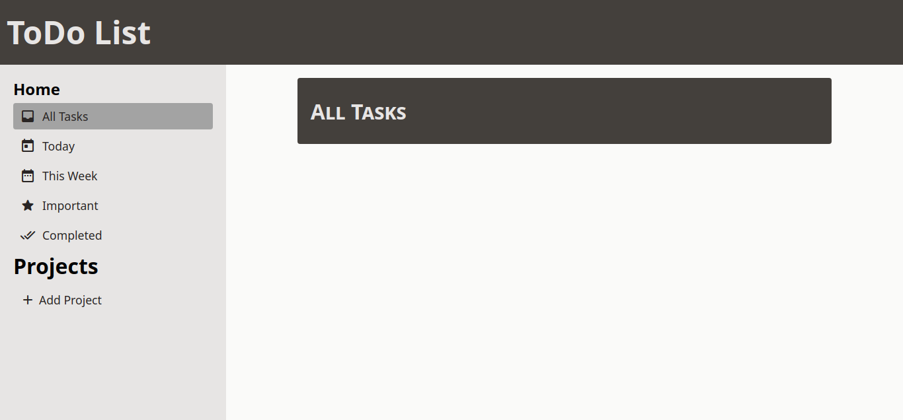

# Todo-list Webapp

## result

- This is a basic Todo-List
- Package date-fns is used
- Live Preview: [here](https://saikatdb.github.io/todo-list/)

## Features
- All tasks can be seen as when opening the app
- New projects can be made
- New tasks can be created only when the created project was selected
- The projects and tasks can be deleted
- Task can be made important by clicking the star icon
- All completed tasks can be seen in Completed list
- Task date can be changed
